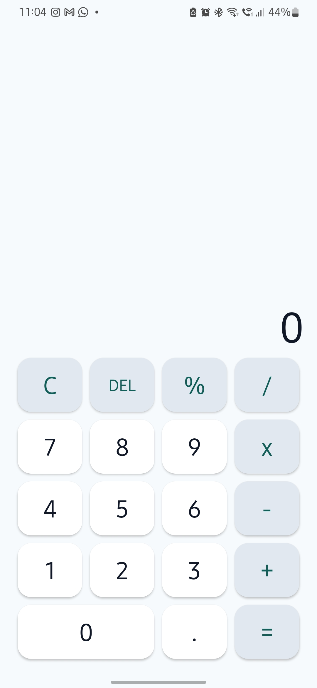
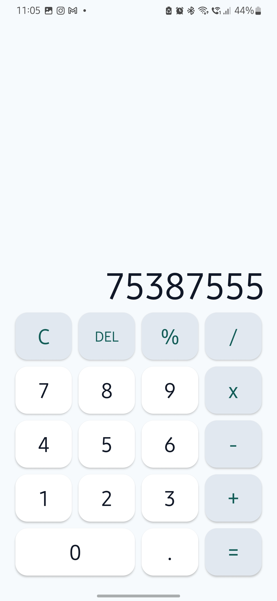
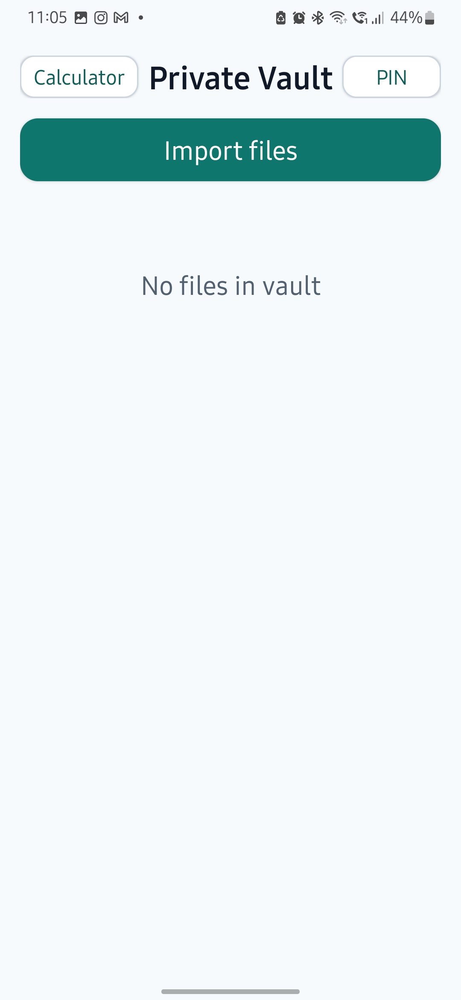
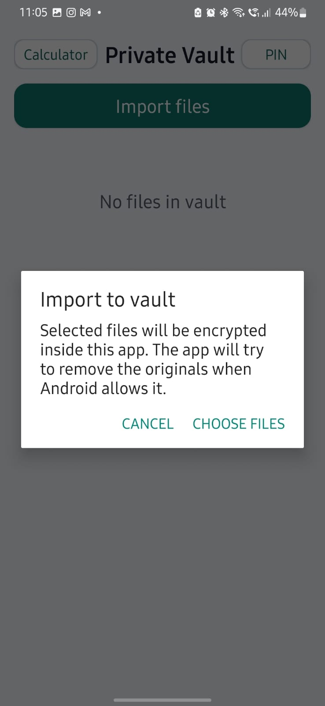
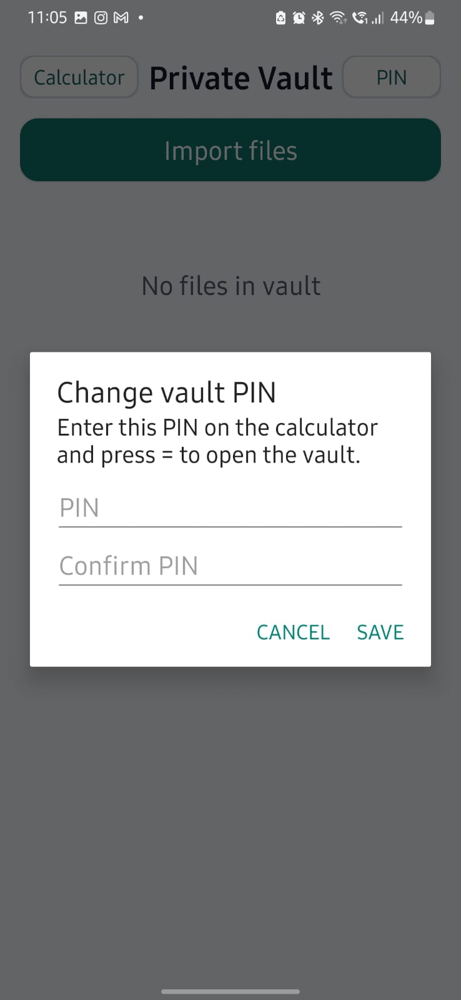

<div align="center">

# Vault Calculator

### A native Android calculator with a hidden encrypted file vault


Vault Calculator looks like a clean everyday calculator, but a PIN unlock flow opens a private file vault. Files selected by the user are encrypted locally with AES-GCM and stored inside app-private storage using an Android Keystore-backed key.

[Features](#features) | [Screenshots](#screenshots) | [Security Model](#security-model) | [Run Locally](#run-locally) | [Roadmap](#roadmap)

</div>

## Recruiter Snapshot

| Area | What this project demonstrates |
| --- | --- |
| Android development | Native Java Android app, AndroidX Activity APIs, programmatic UI, Activity Result API |
| Security awareness | AES-GCM encryption, Android Keystore, salted PIN hashing, local-only storage |
| Product thinking | Disguised calculator workflow, first-run setup, restore/delete flows, privacy-first positioning |
| Platform fit | Uses the Android system file picker instead of broad storage permissions |
| Portfolio readiness | Complete README, screenshots, docs, Play Store notes, privacy policy template |

## Features

- Clean calculator interface with basic arithmetic
- Hidden vault unlock by entering the PIN and pressing `=`
- First-run PIN setup and PIN change flow
- Multi-file import through Android's system file picker
- AES-GCM file encryption with per-file IVs
- Android Keystore-backed vault key
- App-private local storage
- Restore and delete vault files
- No server, account system, analytics, ads, or broad storage permission
- Modern AndroidX back handling with `OnBackPressedDispatcher`
- Modern activity result handling with `ActivityResultLauncher`

## Screenshots

<table>
  <tr>
    <td align="center"><strong>Calculator Home</strong></td>
    <td align="center"><strong>PIN Unlock Entry</strong></td>
    <td align="center"><strong>Private Vault</strong></td>
  </tr>
  <tr>
    <td></td>
    <td></td>
    <td></td>
  </tr>
  <tr>
    <td align="center"><strong>Import Confirmation</strong></td>
    <td align="center"><strong>Change PIN</strong></td>
    <td align="center"><strong>Local-first Vault</strong></td>
  </tr>
  <tr>
    <td></td>
    <td></td>
    <td align="center">No cloud sync<br>No account login<br>No analytics<br>No ads</td>
  </tr>
</table>

## Security Model

Vault Calculator is intentionally designed as a local-first privacy utility.

| Layer | Implementation |
| --- | --- |
| File selection | Android system file picker, so users explicitly choose files |
| File encryption | AES/GCM/NoPadding with a fresh IV per encrypted file |
| Key storage | Android Keystore-backed AES key |
| PIN storage | Salted SHA-256 hash, not plaintext |
| Vault location | App-private internal storage |
| Data sharing | No server, no account, no analytics, no ads |

## How The Vault Works

```text
User selects files
        |
        v
Android system file picker grants access
        |
        v
App encrypts file stream with AES-GCM
        |
        v
Encrypted copy is written to app-private storage
        |
        v
Vault metadata is saved locally
        |
        v
User can restore or delete encrypted files
```

The app attempts to remove the original selected file when Android grants that permission. When Android or the document provider does not allow deletion, the app tells the user that manual deletion may be needed.

## Tech Stack

| Category | Tools |
| --- | --- |
| Language | Java 17 |
| Platform | Android SDK 36 |
| Build | Gradle Wrapper 9.4.1, Android Gradle Plugin 9.2.0 |
| Libraries | AndroidX Activity, AndroidX Core |
| Security APIs | Android Keystore, AES/GCM/NoPadding |

## Project Structure

```text
.
|-- app/
|   `-- src/main/
|       |-- java/com/calcvault/privatefiles/MainActivity.java
|       `-- res/
|-- docs/
|   |-- GITHUB_SHOWCASE_GUIDE.md
|   |-- PLAY_STORE_AND_MONETIZATION.md
|   |-- PRIVACY_POLICY_TEMPLATE.md
|   |-- RUN_ON_PC_AND_GITHUB.md
|   `-- screenshots/
|-- gradle/wrapper/
|-- build.gradle.kts
|-- settings.gradle.kts
`-- README.md
```

## Run Locally

1. Install Android Studio.
2. Open this project folder.
3. Let Android Studio sync Gradle and install any missing SDK tools.
4. Start an emulator or connect an Android phone with USB debugging enabled.
5. Run the `app` configuration.

To open the vault:

1. Set a 4 to 8 digit PIN on first launch.
2. Type that PIN into the calculator.
3. Press `=`.

## Build From Command Line

On Windows PowerShell:

```powershell
.\gradlew.bat :app:assembleDebug
```

The project writes generated Gradle build output outside OneDrive to avoid Windows file-lock issues:

```text
C:\Users\harsh\AndroidBuilds\CalculatorVault
```

To override the build output location:

```powershell
.\gradlew.bat :app:assembleDebug -PexternalBuildRoot=C:\AndroidBuilds\CalculatorVault
```

## Privacy Position

This version is intentionally local-first:

- No cloud sync
- No account login
- No analytics
- No ads
- No data selling
- No broad all-files storage permission

If monetization, crash reporting, analytics, or cloud backup is added later, the privacy policy and Play Console Data safety declarations must be updated before release.

## Roadmap

- Add a short demo GIF
- Add biometric unlock as an optional convenience layer
- Add export-all flow for trusted backup locations
- Add instrumented tests for vault import, restore, and delete behavior
- Add a release workflow for debug and signed builds

## Documentation

- [Run on PC and GitHub guide](docs/RUN_ON_PC_AND_GITHUB.md)
- [Play Store and monetization notes](docs/PLAY_STORE_AND_MONETIZATION.md)
- [Privacy policy template](docs/PRIVACY_POLICY_TEMPLATE.md)
- [GitHub showcase checklist](docs/GITHUB_SHOWCASE_GUIDE.md)

## Status

MVP complete and ready for GitHub showcase. Before a production release, capture a demo GIF, review Play Store policy requirements, and test on multiple Android versions.

## Disclaimer

This project is intended for legitimate personal privacy use. Users are responsible for complying with all applicable laws and platform policies.
